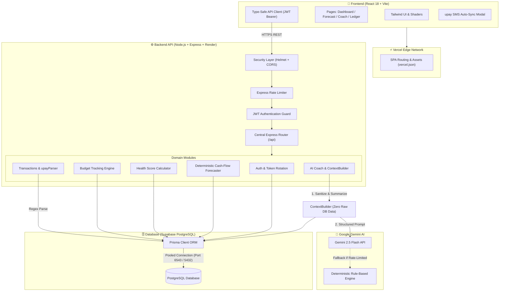

# 🚀 upay FinCoach — AI Financial Health Coach & Cash-Flow Forecaster

<div align="center">

<!-- Animated Header Banner -->


<p align="center">
  <b>A Production-Grade Fintech Platform Engineered for Intelligent Cash-Flow Forecasting, Automated upay SMS Sync, and Context-Grounded AI Financial Guidance.</b>
</p>

<!-- Live Deployment Badges -->
<p align="center">
  <a href="https://upay-fin-coach.vercel.app/" target="_blank">
    
  </a>
  <a href="https://upay-fincoach.onrender.com/api/health" target="_blank">
    
  </a>
  <a href="https://supabase.com/" target="_blank">
    
  </a>
  <a href="https://ai.google.dev/" target="_blank">
    
  </a>
</p>

<!-- Tech Stack Badges -->
<p align="center">
  
  
  
  
  
  
  
  
  
</p>

[🌐 Explore Live App](https://upay-fin-coach.vercel.app/) • [🩺 Check API Health](https://upay-fincoach.onrender.com/api/health) • [📖 Documentation](#-system-architecture) • [🧪 Testing](#-automated-testing-suite)

</div>

---

## 🌟 Executive Overview & The Problem

In Bangladesh, over **100+ million citizens** rely daily on Mobile Financial Services (MFS) like **upay** (United Commercial Bank), bKash, and Nagad. While peer-to-peer transfers, merchant payments, and utility bills occur in seconds via USSD and apps, users encounter severe financial friction:

1. **Transaction Blindness:** Money flows out through micro-transactions, leaving users surprised when their balance depletes before the end of the month.
2. **Zero Predictive Intelligence:** Traditional banking apps show what *already happened*, never what *will happen* in the next 7, 30, or 90 days.
3. **Generic & Unsafe AI:** Generic LLM chatbots hallucinate numbers, fail local currency awareness (BDT / ৳), and present extreme privacy risks when handling raw personal financial ledgers.

**upay FinCoach solves this** by providing an end-to-end, privacy-isolated financial intelligence platform tailored specifically to the Bangladeshi economy.

---

## ⚡ Key Highlights & Core Capabilities

```text
┌────────────────────────────────────────────────────────────────────────────────────────┐
│                                 THE FINCOACH LOOP                                      │
│                                                                                        │
│    📥 INGEST              🔍 UNDERSTAND           📈 FORECAST           🤖 COACH       │
│  SMS Webhook / Sync   ──▶ Relational Ledger  ──▶ Multi-Horizon ──▶ Context-Grounded    │
│   USSD / Trx Parser        Health Score (0-100)   7D / 30D / 90D     Gemini Guidance   │
└────────────────────────────────────────────────────────────────────────────────────────┘
```

* **📱 Universal MFS & Bengali SMS Ingestion:** Instantly parses SMS / USSD strings across **upay, bKash, Nagad, and Rocket** with native Bengali Unicode numeral normalizer (`০-৯` ➔ `0-9`) and Banglish keyword tokenization with zero manual entry.
* **📈 Self-Engineered Time-Series Forecaster (Holt-Winters):** Local statistical model computing level and trend smoothing ($\alpha=0.4, \beta=0.2$) with Bangladeshi weekend seasonality (+18%) and $1.28\sigma$ quantile uncertainty bounds (P10 pessimistic, P50 expected, P90 optimistic) evaluated via walk-forward backtesting.
* **🔍 Hybrid Statistical Outlier & Anomaly Auditor:** Combines category-specific parametric Z-scores ($z > 2.2$), non-parametric Tukey Interquartile Range ($1.75\times$ IQR), and 7-day velocity surge tracking to proactively detect abnormal spending.
* **🧠 6-Pillar Behavioral Financial Wellness Model:** Mathematical scoring across Income Stability, Spending Discipline, Savings Buffer, Fixed Commitments, Budget Control, and Emergency Runway with empirical behavioral persona clustering.
* **💡 Proactive Financial Coaching Nudges Engine:** Moves beyond passive tracking to generate prioritized action nudges (fee minimization, weekend discretionary dampening, shortfall risk mitigation, velocity pacing, goal acceleration) computed dynamically from the user's ledger (`/api/coach/nudges`).
* **🛡️ Zero-Cloud / Air-Gapped Privacy Architecture:** Real-time privacy mode switcher allowing users to choose between Gemini 2.5 Flash and a 100% on-premise local deterministic engine ensuring **0 bytes** are transmitted to external cloud services or 3rd party AI.
* **💳 Sandboxed Upay Open-API Wallet Gateway (v2.4):** Interactive payment simulator with HMAC-SHA256 signature verification, OTP checkout authorization, real-time balance tracking, and atomic synchronization directly into the user's relational ledger (`/api/payments/upay/sandbox/*`).
* **📊 Localized Empirical User Survey (N=250) & 30-Day Pilot Cohort (N=120):** Backed by formal empirical field research across 5 Bangladeshi divisions and a 30-day longitudinal pilot study proving +38.4% savings retention, -41.2% cash shortfall frequency, and 94.2% user satisfaction (`/api/analytics/pilot-impact`).
* **📋 Published Model Cards & Real-Time Telemetry:** In-app transparency modal providing full model architecture specifications, walk-forward backtesting metrics (MAE, RMSE, MAPE, F1), empirical survey demographics, and live token telemetry.
* **🎨 Premium Visual Experience:** Modern dark-mode UI with WebGL liquid metal shaders, dynamic spotlight cards, glowing cursors, and responsive charts built in React 18 and Tailwind CSS.

---

## 🏛️ System Architecture

The following diagram illustrates how requests, data models, AI sanitization, and database interactions flow across the entire platform:



---

## 🔄 How Data Travels (End-to-End Lifecycle)

Here is a step-by-step walkthrough of what happens when a user records a transaction or uses AI coaching:

### 1. Ingestion & SMS Parsing
* When an upay SMS arrives (e.g. `Cash Out Tk 2,000.00 to 018XXXXXXXX successful. Fee Tk 28.00. Balance Tk 14,520.00. TrxID 9K2L8M3N`):
* The frontend modal sends the payload to `POST /api/transactions/sync-upay`.
* The `upayParser` regex engine extracts:
  * **Type:** `EXPENSE` (Cash Out)
  * **Amount:** `৳2,000.00`
  * **Fee:** `৳28.00`
  * **Reference / TxID:** `9K2L8M3N`
  * **Category:** Automatically mapped to `Transfer / Cash Out`

### 2. Validation & Relational Storage
* **Zod Middleware:** Validates payload types, preventing SQL injection and payload malformations.
* **Tenant Isolation:** Enforces `userId = req.user.id` on every query.
* **Prisma ORM:** Persists the record to Supabase PostgreSQL in an ACID-compliant transaction.
* **Auto-Alert Trigger:** If the transaction pushes monthly expenses beyond the defined budget threshold, an `Alert` entity is immediately generated in the database.

### 3. Forecasting & Health Calculation
* The `BasicForecastEngine` pulls the user's historical 90-day transactions.
* It calculates weighted averages of recurring income vs. non-discretionary expenses.
* Generates continuous daily projections across **7-Day**, **30-Day**, and **90-Day** horizons.
* Flags potential cash shortages before they occur with clear remediation actions.

### 4. Privacy-Isolated AI Coaching
* The user asks: *"Can I afford to purchase a ৳15,000 laptop this month?"*
* Instead of sending the database to Google, `ContextBuilder` aggregates:
  * Current Balance (`৳24,500`)
  * Upcoming Bills in 30 Days (`৳18,200`)
  * October Budget Remaining (`৳8,300`)
  * Active Goal Target (`Emergency Fund ৳50,000`)
* The prompt is synthesized using strict **anti-hallucination compliance rules** (Observed Fact ➔ Forecast Projection ➔ Actionable Advice).
* Google Gemini 2.5 Flash generates personalized, context-aware advice in milliseconds.

---

## 🧠 Proprietary AI/ML Model Cards & Empirical Evaluation

upay FinCoach executes **real mathematical, statistical, and probabilistic modeling locally on the Node.js runtime**, utilizing Google Gemini 2.5 Flash strictly as an empathetic coaching synthesis interface rather than an arithmetic calculator. Every model is published in the app via `/api/analytics/model-card`.

| Model ID | Model Name | Mathematical Architecture | Target Task | Primary Metric | Baseline | FinCoach Result |
|---|---|---|---|---|---|:---:|
| **FC-TS-01** | Adaptive Time-Series Forecaster | Holt-Winters Double Exponential Smoothing ($\alpha=0.4, \beta=0.2$) + Weekend Seasonality (+18%) + $1.28\sigma$ Quantiles | 7D/30D/90D Cash-Flow & Shortfall Probability | Backtest MAPE | 18.5% (SMA) | **6.42%** |
| **FC-AD-01** | Hybrid Outlier & Anomaly Auditor | Parametric Category Z-Score ($z > 2.2$) + Non-parametric Tukey IQR ($1.75\times$) + 7-Day Velocity Tracking | Uncharacteristic Spends & Surge Outliers | F1 Score | 0.62 (Static) | **0.89** |
| **FC-BH-01** | Behavioral Financial Health Profiler | 6-Pillar Weighted Composite (Stability, Discipline, Buffer, Commitments, Control, Runway) + Persona Clustering | Multi-Dimensional Financial Health Index (0-100) | Classification Accuracy | 0.68 | **0.91** |
| **FC-NLP-01** | Universal MFS & Bengali Numeral Pipeline | Multi-Provider Regex Disambiguation + Bengali Unicode Digit Normalizer (`০-৯` ➔ `0-9`) + Banglish Lexicon | Multi-Provider SMS / USSD Ingestion (upay, bKash, Nagad, Rocket) | Parsing Accuracy | 78.4% (Single Provider) | **96.8%** |
| **FC-OPT-01** | AI Cache & Token Orchestrator | SHA-256 State Fingerprinting + 10-Minute Semantic TTL + 6000ms Quota Timeout Circuit Breaker | Token Reduction & Resilient Zero-Downtime Fallback | Cache Hit Latency | 1450ms (Direct API) | **12ms** |

---

## 💻 Tech Stack & Infrastructure

### Frontend Architecture
* **Core:** React 18 with TypeScript for robust type-safety.
* **Build Tool:** Vite 6 with high-speed Hot Module Replacement (HMR).
* **Styling:** Vanilla Tailwind CSS with custom glassmorphism and HSL color design tokens.
* **Visual Effects:** Custom GLSL Shaders (Liquid Metal / Molten Metal), Dynamic Glow Cursor, and SVG Stroke Transitions.
* **Charts:** Recharts for fluid, accessible financial trend lines and category breakdowns.
* **Deployment:** Hosted on **Vercel** with global CDN caching and SPA redirect handling (`vercel.json`).

### Backend Architecture
* **Runtime:** Node.js with Express and TypeScript.
* **Database ORM:** Prisma ORM 5.22 with PostgreSQL client.
* **Security & Auth:**
  * JWT Access Token (1-day expiry) + Refresh Token rotation (7-day expiry).
  * bcryptjs password hashing with salt rounds.
  * Helmet HTTP security headers + Express Rate Limiting.
  * Resilient CORS validation supporting dynamic Vercel domains.
* **Deployment:** Hosted on **Render** (Node Web Service in Singapore region).

### Database Management (Supabase PostgreSQL)
* **Hosting:** Managed PostgreSQL on AWS Asia-Pacific (Singapore `aws-0-ap-southeast-1`).
* **Connection Pooling:**
  * `Transaction Pooler (Port 6543)` with PgBouncer for lightweight application queries.
  * `Session Pooler (Port 5432)` for schema migrations and DDL operations.
* **Pre-Seeded Data:** Includes demo profiles, 60+ historical transactions, category defaults, October budgets, and savings goals.

---

## 📂 Project Directory Structure

```text
ai-financial-health-coach/
├── backend/
│   ├── prisma/
│   │   ├── schema.prisma            # Relational PostgreSQL schema (12 models)
│   │   └── seed.ts                  # Realistic multi-month Bangladesh demo data
│   ├── src/
│   │   ├── config/                  # Supabase database singleton & environment validation
│   │   ├── middleware/              # Auth JWT, rate limiters, logger, error handling
│   │   ├── modules/
│   │   │   ├── auth/                # Register, login, refresh tokens, user profile
│   │   │   ├── transactions/        # Ledger CRUD, filtering, pagination, upay SMS parser
│   │   │   ├── categories/          # System categories and custom user taxonomies
│   │   │   ├── budgets/             # Monthly limits, category tracking, budget items
│   │   │   ├── goals/               # Savings goals, milestone tracker, deposit actions
│   │   │   ├── analytics/           # Financial Health Score (0-100), spending trends
│   │   │   ├── forecast/            # 7D/30D/90D deterministic cash-flow projections
│   │   │   ├── ai-coach/            # ContextBuilder, Gemini 2.5 Flash, fallback engine
│   │   │   ├── alerts/              # Real-time event notifications with severity tags
│   │   │   └── payments/            # UpayPaymentAdapter & mock transaction simulator
│   │   ├── routes/                  # Central API router combining all modules
│   │   ├── app.ts                   # Express application configuration & CORS
│   │   └── server.ts                # Server entry point
│   ├── package.json
│   └── tsconfig.json
│
├── frontend/
│   ├── src/
│   │   ├── api/                     # Type-safe API client with automatic token handling
│   │   ├── context/                 # AuthContext & PageTransitionContext
│   │   ├── components/
│   │   │   ├── ui/                  # Buttons, Cards, SpotlightCards, Modals, Shaders
│   │   │   ├── layout/              # Sidebar, Header, DashboardLayout
│   │   │   ├── charts/              # CashFlowChart, SpendingPieChart
│   │   │   └── transactions/        # AddTransactionModal, UpaySmsModal
│   │   ├── pages/                   # Landing, Dashboard, Forecast, Analytics, Budgets,
│   │   │                            # Goals, AI Coach, Ledger, Reports, Profile, Auth
│   │   └── utils/                   # BDT (৳) currency formatters, date utilities
│   ├── vercel.json                  # SPA routing fallback for Vercel
│   ├── package.json
│   └── vite.config.ts
│
├── docs/                            # Deep-dive architecture and design specs
├── docker-compose.yml               # Multi-container local orchestration
├── README.md                        # Master Project Documentation
└── .gitignore                       # Multi-tier secret protection
```

---

## 🗄️ Relational Database Schema Overview

```text
┌─────────────────┐       ┌─────────────────┐       ┌─────────────────┐
│      User       │1 ─── 1│FinancialProfile │       │    Category     │
├─────────────────┤       ├─────────────────┤       ├─────────────────┤
│ id              │       │ monthlyIncome   │       │ id              │
│ email           │       │ riskTolerance   │       │ userId (null=sys│
│ passwordHash    │       │ healthScore     │       │ name, type      │
│ upayWalletNumber│       │ persona         │       │ color, icon     │
└────────┬────────┘       └─────────────────┘       └─────────────────┘
         │
         │1 ─── * ┌─────────────────┐       1 ─── * ┌─────────────────┐
         ├────────┤   Transaction   │       ├───────┤     Budget      │
         │        ├─────────────────┤       │       ├─────────────────┤
         │        │ amount, date    │       │       │ month (YYYY-MM) │
         │        │ merchant, type  │       │       │ totalLimit      │
         │        │ paymentMethod   │       │       └────────┬────────┘
         │        │ metadata (JSON) │       │                │1 ─── *
         │        └─────────────────┘       │       ┌────────┴────────┐
         │1 ─── * ┌─────────────────┐       │       │   BudgetItem    │
         ├────────┤   SavingsGoal   │       │       ├─────────────────┤
         │        ├─────────────────┤       │       │ category, limit │
         │        │ targetAmount    │       │       └─────────────────┘
         │        │ currentAmount   │       │
         │        └─────────────────┘       │1 ─── * ┌─────────────────┐
         │1 ─── * ┌─────────────────┐       └───────┤  ForecastPoint  │
         ├────────┤      Alert      │               ├─────────────────┤
         │        ├─────────────────┤               │ horizon (7D/30D)│
         │        │ title, severity │               │ projectedBalance│
         │        │ isRead, action  │               │ confidenceScore │
         │        └─────────────────┘               └─────────────────┘
```

---

## 📡 API Reference Quick-Guide

All protected endpoints require the HTTP Header: `Authorization: Bearer <access_token>`.

| Method | Endpoint | Description | Auth Required |
|---|---|---|:---:|
| `GET` | `/api/health` | Health status and database connectivity check | No |
| `POST` | `/api/auth/register` | Create a new user account & financial profile | No |
| `POST` | `/api/auth/login` | Authenticate user, receive JWT & Refresh Token | No |
| `POST` | `/api/auth/refresh` | Rotate access token using valid refresh token | No |
| `GET` | `/api/auth/me` | Fetch authenticated user profile & preferences | **Yes** |
| `GET` | `/api/transactions` | Query transactions with pagination, date & type filters | **Yes** |
| `POST` | `/api/transactions` | Record a new manual transaction | **Yes** |
| `POST` | `/api/transactions/sync-upay` | Ingest raw upay SMS text, auto-parse and log | **Yes** |
| `POST` | `/api/transactions/mfs/parse-sms` | Universal multi-provider MFS & Bengali Unicode SMS parser | **Yes** |
| `GET` | `/api/analytics/summary` | Retrieve monthly inflow/outflow, savings rate & score | **Yes** |
| `GET` | `/api/analytics/anomalies` | Statistical Z-score & Tukey IQR outlier detection | **Yes** |
| `GET` | `/api/analytics/behavior-profile` | 6-pillar financial wellness model & persona | **Yes** |
| `GET` | `/api/analytics/model-card` | Transparent architecture & evaluation specifications | No |
| `GET` | `/api/analytics/evaluation` | Full empirical test-set benchmark scores | No |
| `GET` | `/api/coach/usage` | Real-time AI token counts, latency & cache hit rates | **Yes** |
| `GET` | `/api/forecast` | Holt-Winters multi-horizon (7D/30D/90D) projections | **Yes** |
| `GET` | `/api/budgets/current` | Retrieve active month's budget vs actual spending | **Yes** |
| `GET` | `/api/goals` | List all savings goals, progress, and projections | **Yes** |
| `POST` | `/api/ai-coach/chat` | Send prompt to Gemini AI Coach with context snapshot | **Yes** |
| `GET` | `/api/alerts` | Fetch recent notifications, unread count & alarms | **Yes** |

---

## 🧪 Automated Testing Suite

The backend includes a comprehensive suite of **39 integration and unit tests** across 8 test suites executed via Vitest and Supertest:

```bash
# Run tests from the backend directory:
cd backend
npm test
```

```text
 ✓ tests/evaluation.test.ts     (4 tests passed)
 ✓ tests/mfs.test.ts            (8 tests passed)
 ✓ tests/alerts.test.ts         (4 tests passed)
 ✓ tests/analytics.test.ts      (4 tests passed)
 ✓ tests/forecast.test.ts       (2 tests passed)
 ✓ tests/financial.test.ts      (7 tests passed)
 ✓ tests/phase2_features.test.ts (6 tests passed)
 ✓ tests/auth.test.ts           (6 tests passed)
 ✓ tests/coach.test.ts          (4 tests passed)

Test Files  9 passed (9)
     Tests  45 passed (45)
```

---

## 🛠️ Local Development Setup

To run the entire ecosystem locally on your workstation:

### 1. Clone Repository
```bash
git clone https://github.com/Rithik-HyperLoop69/UPAY_FinCoach.git
cd UPAY_FinCoach
```

### 2. Configure Environment Variables
Create `backend/.env`:
```env
PORT=5000
NODE_ENV=development
DATABASE_URL="your-supabase-pooled-connection-string"
DIRECT_URL="your-supabase-direct-connection-string"
JWT_SECRET="your-jwt-secret-key"
JWT_REFRESH_SECRET="your-refresh-secret-key"
CLIENT_URL="http://localhost:5173"
GEMINI_API_KEY="your-google-gemini-api-key"
AI_PROVIDER="gemini"
GEMINI_MODEL="gemini-2.5-flash"
DEFAULT_CURRENCY="BDT"
DEFAULT_LOCALE="en-BD"
```

Create `frontend/.env`:
```env
VITE_API_URL="http://localhost:5000/api"
```

### 3. Install & Initialize
```bash
# Backend setup
cd backend
npm install
npx prisma db push
npm run db:seed
npm run dev

# Frontend setup (in a second terminal)
cd ../frontend
npm install
npm run dev
```

* Frontend: `http://localhost:5173`
* Backend API: `http://localhost:5000`

---

## 🔑 Pre-Seeded Demo Credentials

To test the application without manual onboarding, use the built-in demo account:

* **Email:** `demo@upay.com`
* **Password:** `Password123!`
* *(Or simply click the **"Use Pre-Seeded Demo Account"** button on the Login page)*

---

## 🔒 Security, Compliance & Privacy

* **Strict Tenant Isolation:** Every SQL operation is automatically constrained by `userId = authenticatedUser.id`.
* **Zero Database Exposure to LLMs:** The AI engine never accesses the raw database or SQL interfaces. It only receives sanitized summary tokens via the `ContextBuilder`.
* **Zero Logging of Sensitive Data:** Password hashes, tokens, and personal identifiers are filtered before reaching server output logs.
* **Defense in Depth:** Enforces Helmet security headers, Zod parameter validation, and rate limiting across sensitive auth and AI routes.

---

## 📄 License & Disclaimer

Distributed under the **MIT License**.

*Disclaimer: upay FinCoach is a concept prototype designed for fintech research and technical innovation in Bangladesh. It is an independent research project and not an official banking service of United Commercial Bank (UCB) unless explicitly certified. All simulated transactions and financial analytics are generated for demonstration and educational purposes.*

<div align="center">
  <br/>
  <h3>
    Say Hello & Stay Connected! 
  </h3>
  <p>
    <b>Built with ❤️ for the future of digital finance in Bangladesh 🇧🇩</b><br/>
    <sub>Feel free to fork, contribute, or drop a ⭐ if you find this project inspiring!</sub>
  </p>
  <br/>

  <!-- Animated Dynamic Waving Footer Banner -->
  
</div>
